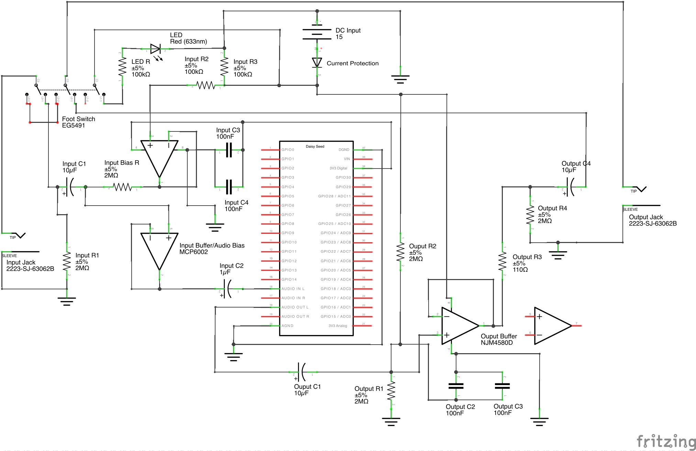
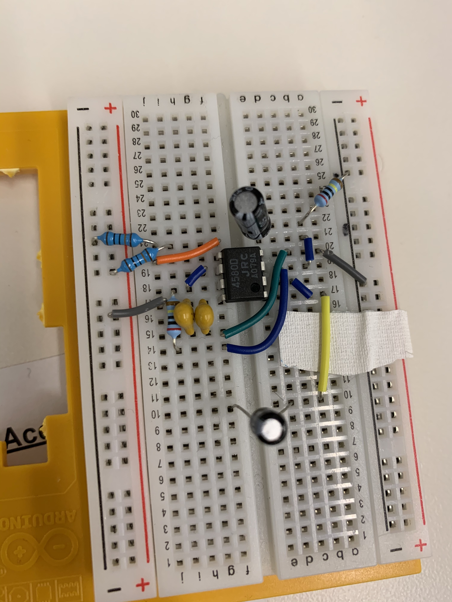
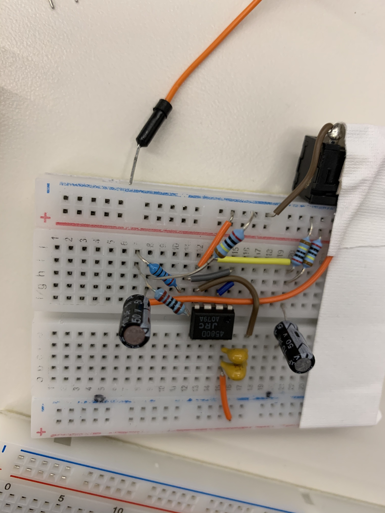
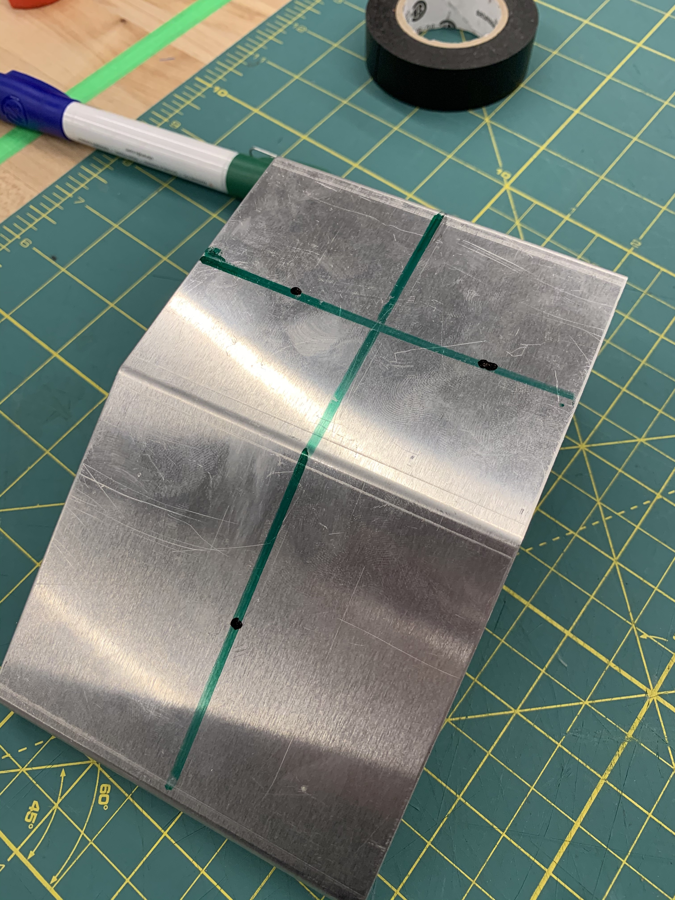
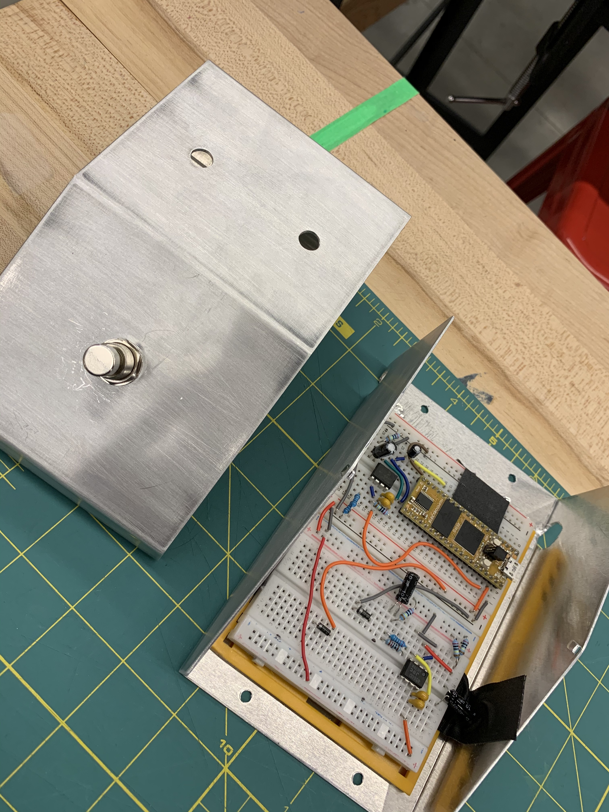
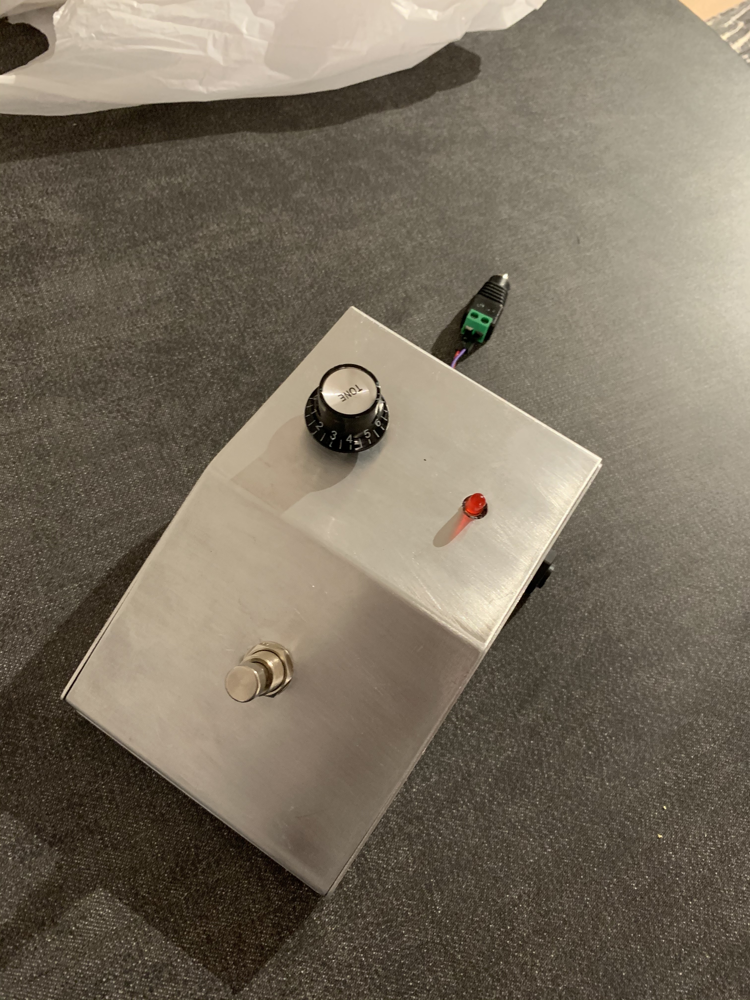

# PedalBoi
A guitar pedal powered by the [Electrosmith Daisy](https://www.electro-smith.com/daisy/daisy) microcontroller platform. The goal is to have a fully programmable pedal that can be customised with any effect via digital signal processing. The programmed effect is currently a distortion, hard clipping the input.

Why create something like this? Individual guitar pedals are quite expensive and the signal chain can get quite cumbersome/complex if you have many pedals. So being able to program any effect (or multiple), into a single pedal solves for both these things. Combined with on demand upload, this would be a great addition to a guitarists arsenal!

## Functionality
### Core:
* ~~Circuit Design with Audio Buffers~~
* ~~Distortion Effect~~
*  ~~60Hz Noise removal~~
* ~~3PDT Switch Integration~~
*  ~~Initial prototype with premade enclosure~~
* Implement Potentiometer

### Future Work
* Create a PCB design with mountable female headers for the Daisy Seed and USB-C power delivery/USB passthrough
* Create a custom 3D (printable) enclusure
* Create mounting hardware for PCB and internal components for custom enclosure
* Implement bluetooth module for wireless effect uploading 
* Create web/app interface to facilitate wireless effect upload
* Live control of effect via an app

## Usage
Compile PedalBoi
```makefile
make
```

Upload binary to Daisy
```makefile
make program-dfu
```

## Build of Materials and Schematic

### Documentation
For a detailed build of core materials, consult this [document](bom.pdf).

Any enclosure may be used, such the [aluminium console](https://www.digikey.com/en/products/detail/lmb-heeger-inc/MDC752-PLAIN/1738) which was chosen for the initial prototype.

### Current Circuit Schematic
The circuit consists of three major parts; the input buffer (left), the output buffer (right) and the Daisy seed microcontroller (middle). The schematic was created using [Fritzing](https://fritzing.org), check the program out! 


### Material Motivation
The circuit was largely butchered from the [Daisy Petal schematic](https://github.com/electro-smith/Hardware/blob/master/reference/daisy_petal/ES_Daisy_Petal_Rev5.pdf) with most of the circuit design and components being the same, though it is heavily simplified and uses breadboardable components as opposed to TSSOP. This was mostly done as I had never designed an audio sensitive analog circuit like this before. With regards to casing and footswitch, those were recommendations given by my Professor (thanks Wendy!)

The goal was to use as much established literature as much as I could in order to focus on actually building and refinining the pedal (as it turns out, analog electrical issues are hard and took up all my time).

## Major components

### Input Buffer
The first core component of the project is the input buffer circuit. This effectively allows us to take a high impedance signal and transform it into a low impedance signal. This is importoant as the pickups of any electric guitar are high impedance, don't do not allow much current to flow through them. Using the Op-Amps of the MCP6002 IC, we can both bias the input to a specific voltage and ensure that signal is unity gain.



### Output Buffer
Similarly to the input buffer, the output buffer circuit ensures our signal remains at unity gain. In this case, we use an OpAmp designed to handle higher voltage signals and spikes specifically for audio. This allows the circuit to handle effects like high-gain distortion.



### 3PDT Switch
The 3PDT switch allows the input and output jacks to be directly wired to eachother when the switch is off, and connected to the processing circuit when the switch engaged. This is crucial in ensuring the least amount of noise possible when the pedal is off. A resource explaining how this is acheived can be found [here](https://www.coda-effects.com/2015/03/3pdt-and-true-bypass-wiring.html). 


### Enclosure
Points for mounting holes were determined via cross-section as shown in the photo below. For the v1 prototype, a drill with predetermined tip sizes was used to create mounting holes on both the top half of the enclosure and the bottom half.

Top Half:
* 2 holes for the LED and potentiometer (to be implemented)
* One large hole for the footswitch

Bottom Half:
* 2 holes on either side for the input and output jacks.






### Daisy Seed
The Daisy Seed is a microcontroller specifically designed for audio processing and synthesis. It comes packaged with a variety of components needed for audio applications, including multiple ADCs, DACs, (stereo) audio input/output and a fast M7 microprocessor with enourmous cache allowing for memory havey effects such as complex *delay*. There are also an array of libraries included with the platform to both program the board and conduct DSP on analog input signals using C++. See [PedalBoi.cpp](PedalBoi.cpp) for distortion implementation details.

* Daisy Interface Library - [libdaisy](https://github.com/electro-smith/libDaisy)
* DSP Library - [DaisySP](https://github.com/electro-smith/DaisySP)


## Final Build
The final build comprised of the modified aluminium console containing the breadboard prototypes and 3PDT Switch, secured via 2 screws at the bottom of the console. Any 13-18V DC power source can be used to power the petal via a positive and negative lead extending outside the case.




## V1 Reflections
This was a great initial foray into processing real analog signals digitally and was lots of fun to build an initial proof of concept. However, there were a few significant issues throughout this V1 iteration:

### Ground loops
Ground loops caused by different AC power sources were a substantial source of noise in the initial design of the pedal. It was tough to analyse and debug where the noise was actually coming from. Eventually, the entire circuit had to redone with the help of an Oscilloscope.
### Incorrect Op-Amp functionality
The NJM4580D is a great Op-Amp for audio applications. However there is one substantial problem; it does not support rail-rail power. This proved to be an issue in the initial circuit design, which only supplied 5V via breadboard rails resulting in a power differential in the Op-Amp which caused it to malfunction. Luckily, the problem could be solved by applying more voltage over the NJM4580D Op-Amp, while simultaneously supplying the MCP6002 Op-Amps with the 3V3 supply directly from the Daisy Seed.
### Lack of space due to breadboards and prebuilt enclosure
As V1 used a prebuilt enclosure and breadboards, there was little space leftover for the audio jacks at the back of the case (resulting in the input audio jack being skew). This also made it impossible to mount the DC barrel plug inside the case, as the plug needed to be elevated. In the future this can be solved with the combination of a custom PCB, custom enclosure and internal mounting brackets.
## Oscilloscope Breadboard Demo
[](https://youtu.be/5Jb7ozU0aHI "Oscilloscope Demo")

## PedalBoi_v1 Demo:
[](https://youtu.be/re2_l2MvA74 "PedalBoi_v1 Demo") 