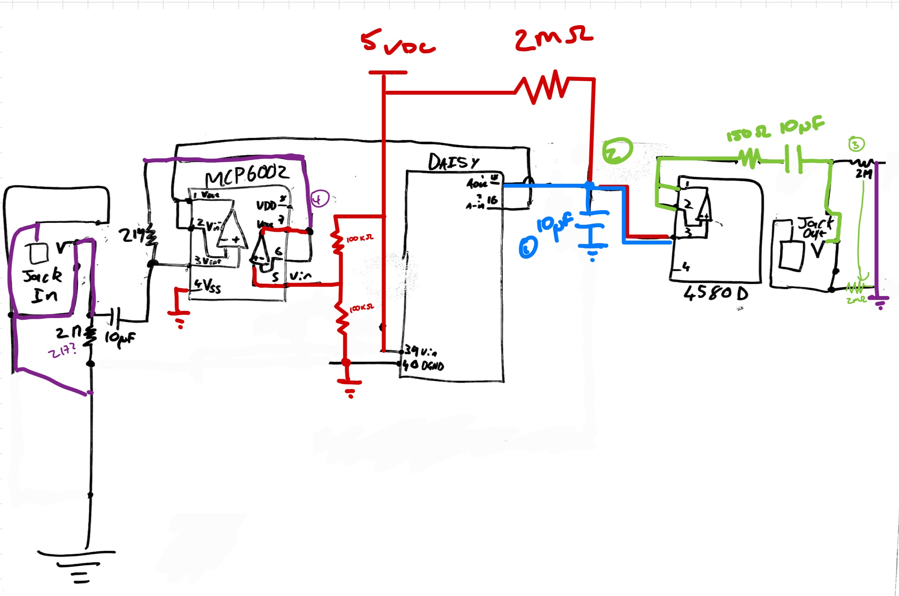

## 13/11
Received initial components to prototype with.

This includes:
+ [Electrosmith Daisy Seed](https://www.electro-smith.com/daisy/daisy) 
+ Aluminium Console
+ [MCP6002-I/P-ND General Purpose OpAmp for input buffering](https://www.digikey.com/en/products/detail/microchip-technology/MCP6002-I-P/500875?s=N4IgTCBcDaILIGEAKA2ADGsBaAkgeiSwDkAREAXQF8g)
+ [NJM4580D-ND Audio OpAmp for output buffering](https://www.digikey.com/en/products/detail/njr-corporation-njrc/NJM4580D/673772?s=N4IgTCBcDaIHICkCyAWArADgAwBEC0cOIAugL5A)
+ [2 1/4" audio jacks (2223-SJ-63062B-ND)](https://www.digikey.com/en/products/detail/cui-devices/SJ-63062B/13155750?s=N4IgTCBcDa5mBmAtAZQFJIGwIAybAEJIByAIiALoC%2BQA)

The initial plan is to build a simple circuit with OpAmps, the jacks and the 5V power supply I have, and have audio simply pass through the Daisy board. The next step will be to program an effect.

## 22/11
Designed initial simple prototype. Simply takes in an audio signal and outputs the same signal. See `prototype_1.asc` for sim.

